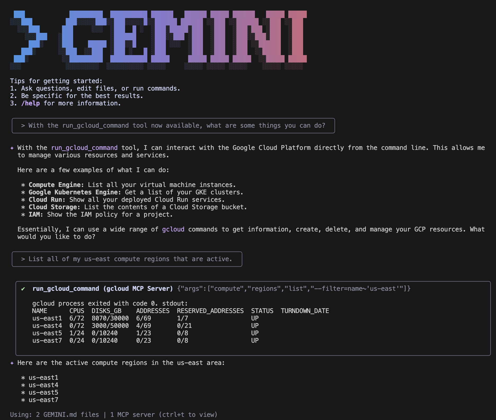

# ☁️ Google Cloud MCP

> [!NOTE]
> This repository is currently in prerelease, and may see breaking changes
> until the first stable release (v1.0). 
> * This repository is providing a _solution_, not an officially supported 
> Google _product_. This project is not eligible for the [Google Open Source Software Vulnerability Rewards Program](https://bughunters.google.com/open-source-security).
> * This project may break when the MCP specification changes, when other 
> SDKs change, or when other solutions or products change. 
> * This solution is expected to be run by customers **at their own risk**.

Google Cloud offers a suite of specialized
[Model Context Protocol (MCP)](https://modelcontextprotocol.io/introduction)
servers that make Google Cloud products directly accessible to AI agents.

Our MCP servers work with any tool that can act as an MCP client, including
Claude Desktop, Cline, Cursor, Gemini CLI, Gemini Code Assist, Visual Studio
Code Copilot Editor, Windsurf, and more.



**Available MCP Servers**

| Name              | Description                                                                   |
| ----------------- | ----------------------------------------------------------------------------- |
| gcloud MCP        | Interact with Google Cloud via the gcloud CLI using natural language prompts. |
| Observability MCP | Access Google Cloud Observability APIs to query logs, metrics, and traces.    |

## 🚀 Getting Started

To get started with an MCP server, make sure you have the following installed:

- [Node.js](https://nodejs.org)
- [gcloud CLI](https://cloud.google.com/sdk/docs/install)

## ✨ Setup your MCP server

### Instructions for Gemini CLI and Gemini Code Assist

The recommended way to configure Gemini CLI or Gemini Code Assist to use the gcloud MCP server is as a
[Gemini CLI extension](https://github.com/google-gemini/gemini-cli/blob/main/docs/extension.md).
Refer [here](#gemini-cli) for an alternate configuration method.

The following command sets up the MCP server:

```
$ npx -y @google-cloud/gcloud-mcp init --agent=gemini-cli
```

- Run the command in your project directory to set up for one project
- Run the command in home directory to set up for all projects

Running the command will create the following files in the directory you ran it from:

- `.gemini/extensions/gcloud-mcp/gemini-extension.json`
- `.gemini/extensions/gcloud-mcp/GEMINI.md`

### Instructions for other AI Code Assistants

Add the following configuration to the AI Code Assistant of your choice.

```
"mcpServers": {
  "gcloud-mcp": {
    "command": "npx",
    "args": ["-y", "@google-cloud/gcloud-mcp"]
  },
  "observability-mcp": {
    "command": "npx",
    "args": ["-y", "@google-cloud/observability-mcp"]
  }
}
```

Here are specific instructions for some popular tools:

#### Claude Desktop

To configure Claude Desktop to use an MCP server, edit the
`claude_desktop_config.json` file. You can open or create this file from the
**Claude > Settings** menu. Select the **Developer** tab, then click **Edit Config**.

#### Cline

To configure Cline to use an MCP server, edit the
`cline_mcp_settings.json` file. You can open or create this file by clicking the
MCP Servers icon at the top of the Cline pane, then clicking the **Configure MCP
Servers button**.

#### Cursor

To configure Cursor to use an MCP server, edit either

- the file `.cursor/mcp.json` (to configure only a specific project) or
- the file `~/.cursor/mcp.json` (to make the MCP server available in all projects).

#### Visual Studio Code Copilot

To configure a single project, edit the `.vscode/mcp.json` file in your
workspace.

To make the server available in every project you open, edit your
[user settings](https://code.visualstudio.com/docs/getstarted/personalize-vscode).

#### Gemini CLI

If you do not wish to use Gemini CLI extensions as described in
[Instructions for Gemini CLI and Gemini Code Assist](#instructions-for-gemini-cli-and-gemini-code-assist) section, you can
edit either

- the file `.gemini/settings.json` (to configure only a specific project) or
- the file `~/.gemini/settings.json` (to make the MCP server available in all projects).

You can add an excludeTools configuration to your gemini-extensions.json file to block Gemini-CLI from invoking gcloud commands with the shell tools. A sample configuration is shown below.

```
{
    "excludeTools": ["ShellTool(gcloud)"]
}
```

## Denylist

The denylist feature provides a powerful security mechanism to control which `gcloud`
commands can be executed by the AI agent. By default, the agent has access to a wide range of commands, some of which could make
significant changes to your cloud environment. The denylist allows you to explicitly block certain commands or command groups, preventing unintended or unauthorized operations.
This is particularly useful for production environments or when you want to enforce a more restrictive set of permissions for the AI agent.

The denylist behavior is that if the user blocks a particular command group, it will block all operations associated with the command.

The user can specify a custom configuration file to the MCP server via the `--config` flag. The user specified denied commands will be merged with the default denied commands.

_Example deny list config file_:

```
{
   "run_gcloud_command" : {
       "denylist" : [
           "bms",
           "deploy delete"
       ]
   }
}
```

In order for the MCP server to utilize the configuration file, the user needs to edit their MCP configuration to include the `--config` flag. If you had initialized the MCP Server for Gemini CLI using `npx -y @google-cloud/gcloud-mcp init --agent=gemini-cli` then update the `extensions.json file`.
The path to the configuration file _MUST_ be an absolute path.

_Example gemini-extension.json file with config file argument_

```
{
  "mcpServers": {
    "gcloud": {
      "command": "npx",
      "args": [
        "-y",
        "@google-cloud/gcloud-mcp",
        "--config",
        "~/{absolute_path}/config.json"
      ]
    }
  }
}
```

gcloud-MCP supports all gcloud commands by default but some commands pose a security threat. Any command that can open an unrestricted SSH tunnel will be blocked.

›

## 💫 Other Google Cloud MCP Servers

You can also try our other MCP servers:

- [Cloud Run MCP](https://github.com/GoogleCloudPlatform/cloud-run-mcp)
- [Databases MCP](https://github.com/googleapis/genai-toolbox)
- [GKE MCP](https://github.com/GoogleCloudPlatform/gke-mcp)

## Important Security Notice 🛡️

The permissions of the credentials used by this agent directly control which `gcloud` commands it can execute. Proper configuration of the underlying credentials is critical for secure operation.

### Using High-Privilege Roles (Writer)

Assigning a broad role like **Writer** (`roles/writer`) to the active credentials grants it powerful permissions. This allows for **mutating actions**—such as creating new virtual machines, deleting storage buckets, or modifying IAM policies. While this enables full functionality, it carries significant risk and should be used with caution.

### Using Read-Only Roles (Reader)

For enhanced security, you can use credentials with the **Reader** (`roles/reader`) role. This strictly limits the agent to **non-mutating (read-only) actions**, such as listing resources or describing configurations. This is the **recommended and safest approach** if you only need the agent to inspect your Google Cloud environment.

We strongly advise adhering to the **principle of least privilege**. Always use credentials with the minimum permissions required for its intended tasks.

## 👥 Contributing

We welcome contributions to the gcloud MCP Server! Whether you're fixing bugs,
sharing feedback, or improving documentation, your contributions are
welcome.

Please read our
[Contributing Guide](https://github.com/googleapis/gcloud-mcp/blob/main/CONTRIBUTING.md)
to get started.
